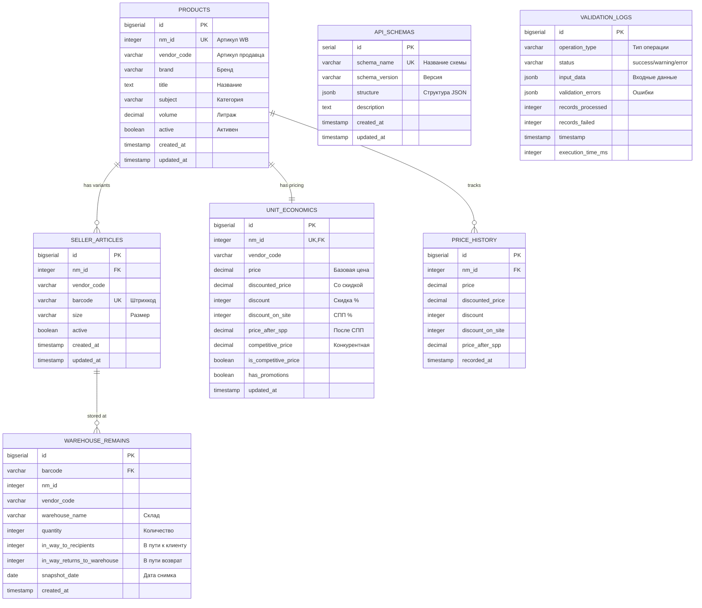

# База данных Wildberries API - Документация

## 📋 Содержание

1. [Анализ структуры](#анализ)
2. [ER-диаграмма](#er-диаграмма)
3. [SQL Схема](#sql-схема)
4. [Примеры запросов](#примеры-запросов)
5. [Интеграция с Python](#интеграция-с-python)

---

## Анализ

### 🎯 Цель БД

Автоматизация работы с Wildberries API:
- **Фетч** данных из WB API (list_of_seller_articles, discount_prices, warehouse_remains)
- **Валидация** структуры и типов данных
- **Хранение** в Supabase PostgreSQL с RLS
- **Агрегация** и экспорт в Google Sheets

### 🗂️ Сущности

#### 1. **Products** (Товары)
Основная таблица карточек товаров из Content API.

**Атрибуты:**
- `id` (BIGSERIAL, PK) — внутренний ID
- `nm_id` (INTEGER, UNIQUE) — артикул WB (nmID)
- `vendor_code` (VARCHAR) — артикул продавца
- `brand` (VARCHAR) — бренд
- `title` (TEXT) — название товара
- `subject` (VARCHAR) — категория/класс товара
- `volume` (DECIMAL) — объем упаковки (литры)
- `active` (BOOLEAN) — активность товара
- `created_at` (TIMESTAMP) — дата создания
- `updated_at` (TIMESTAMP) — дата обновления

**Индексы:**
- `nm_id` (UNIQUE)
- `vendor_code`
- `brand`
- `active`
- `updated_at DESC`

---

#### 2. **SellerArticles** (Варианты артикулов)
Штрихкоды и размеры товаров (1 nmID → N баркодов).

**Атрибуты:**
- `id` (BIGSERIAL, PK)
- `nm_id` (INTEGER, FK → products.nm_id)
- `vendor_code` (VARCHAR) — дублируем для быстрого доступа
- `barcode` (VARCHAR, UNIQUE) — штрихкод (уникальный)
- `size` (VARCHAR) — размер товара
- `active` (BOOLEAN)
- `created_at`, `updated_at` (TIMESTAMP)

**Индексы:**
- `barcode` (UNIQUE)
- `nm_id`
- `vendor_code`
- `(nm_id, barcode, vendor_code, size)` (UNIQUE композитный)

**Связи:**
- 1:N с Products (один товар → много баркодов)

---

#### 3. **UnitEconomics** (Юнит-экономика)
Цены, скидки, СПП из Discounts-Prices API.

**Атрибуты:**
- `id` (BIGSERIAL, PK)
- `nm_id` (INTEGER, UNIQUE, FK → products.nm_id)
- `vendor_code` (VARCHAR)
- `price` (DECIMAL) — базовая цена
- `discounted_price` (DECIMAL) — цена со скидкой
- `discount` (INTEGER) — скидка продавца (%)
- `add_club_discount` (INTEGER) — скидка WB Клуб (%)
- `discount_on_site` (INTEGER) — СПП (%)
- `price_after_spp` (DECIMAL) — цена после СПП
- `competitive_price` (DECIMAL) — привлекательная цена
- `is_competitive_price` (BOOLEAN)
- `has_promotions` (BOOLEAN)
- `updated_at` (TIMESTAMP)

**Индексы:**
- `nm_id` (UNIQUE)
- `vendor_code`
- `updated_at DESC`
- `is_competitive_price`
- `has_promotions`

**Связи:**
- 1:1 с Products (один товар → одна запись цен)

---

#### 4. **WarehouseRemains** (Остатки на складах)
Ежедневные снимки остатков по складам.

**Атрибуты:**
- `id` (BIGSERIAL, PK)
- `barcode` (VARCHAR, FK → seller_articles.barcode)
- `nm_id` (INTEGER) — дублируем
- `vendor_code` (VARCHAR)
- `warehouse_name` (VARCHAR) — название склада
- `quantity` (INTEGER) — количество на складе
- `in_way_to_recipients` (INTEGER) — в пути к клиенту
- `in_way_returns_to_warehouse` (INTEGER) — в пути возврат
- `snapshot_date` (DATE) — дата снимка
- `created_at` (TIMESTAMP)

**Индексы:**
- `barcode`
- `nm_id`
- `warehouse_name`
- `snapshot_date DESC`
- `(barcode, warehouse_name, snapshot_date)` (UNIQUE композитный)

**Связи:**
- N:1 с SellerArticles (много остатков → один баркод)

---

#### 5. **ApiSchemas** (Схемы валидации)
JSON Schema для валидации данных API.

**Атрибуты:**
- `id` (SERIAL, PK)
- `schema_name` (VARCHAR, UNIQUE) — название схемы
- `schema_version` (VARCHAR) — версия схемы
- `structure` (JSONB) — структура схемы
- `description` (TEXT)
- `created_at`, `updated_at` (TIMESTAMP)

**Индексы:**
- `schema_name`
- `structure` (GIN для поиска по JSONB)

---

#### 6. **ValidationLogs** (Логи валидации)
Отслеживание проблем валидации.

**Атрибуты:**
- `id` (BIGSERIAL, PK)
- `operation_type` (VARCHAR) — тип операции
- `status` (VARCHAR) — success/warning/error
- `input_data` (JSONB) — пример входных данных
- `validation_errors` (JSONB) — ошибки валидации
- `records_processed` (INTEGER)
- `records_failed` (INTEGER)
- `timestamp` (TIMESTAMP)
- `execution_time_ms` (INTEGER)

**Индексы:**
- `operation_type`
- `status`
- `timestamp DESC`
- `validation_errors` (GIN)

---

#### 7. **PriceHistory** (История цен)
Исторические данные изменения цен (14-90 дней).

**Атрибуты:**
- `id` (BIGSERIAL, PK)
- `nm_id` (INTEGER, FK → products.nm_id)
- `price`, `discounted_price`, `discount`, `discount_on_site`, `price_after_spp` (DECIMAL/INTEGER)
- `recorded_at` (TIMESTAMP)

**Индексы:**
- `nm_id`
- `recorded_at DESC`

---

### 🔗 Связи между таблицами

```
Products (1) ──< (N) SellerArticles
    │
    └─ (1:1) UnitEconomics
    │
    └─ (1:N) WarehouseRemains (через barcode)
    │
    └─ (1:N) PriceHistory

ApiSchemas (независимая)
ValidationLogs (независимая)
```

**Кардинальности:**
- `Products → SellerArticles`: **1:N** (один товар → много баркодов/размеров)
- `Products → UnitEconomics`: **1:1** (один товар → одна запись цен)
- `SellerArticles → WarehouseRemains`: **1:N** (один баркод → много снимков по складам/датам)
- `Products → PriceHistory`: **1:N** (один товар → много исторических записей)

---

### 📊 Нормализация

**3NF (Третья нормальная форма):**
- ✅ Нет транзитивных зависимостей
- ✅ Все неключевые атрибуты зависят только от первичного ключа
- ✅ Дублирование `vendor_code` в SellerArticles и UnitEconomics — денормализация для производительности (избегаем JOIN при частых запросах)

**Агрегации:**
- Литраж: суммирование `volume` по `nm_id` для расчета общего объема
- Остатки: суммирование `quantity` по `nm_id` и `warehouse_name` для дневных снимков
- Цены: хранение в `price_history` для анализа изменений за 14-90 дней

**Валидация:**
- `structure_validator`: проверка перед INSERT через `ApiSchemas`
- `data_validator`: проверка после INSERT через сравнение с ожидаемыми значениями
- CHECK constraints: `price >= 0`, `discount 0-100`, `barcode NOT EMPTY`

---

## ER-диаграмма



---

## SQL Схема

Полная SQL-схема находится в файле [`schema.sql`](./schema.sql).

### Основные компоненты:

1. **CREATE TABLE** — 7 таблиц с PK/FK/UNIQUE constraints
2. **Индексы** — B-tree для числовых полей, GIN для JSONB
3. **Триггеры** — автоматическое обновление `updated_at`
4. **RLS (Row Level Security)** — политики для authenticated пользователей
5. **Views** — `v_products_full`, `v_active_articles_export`
6. **Функции** — `upsert_product_with_variants()`, `update_prices_with_history()`, `cleanup_old_logs()`

### Ключевые особенности:

- **JSONB** для гибкого хранения схем (`api_schemas.structure`) и логов (`validation_logs`)
- **CHECK constraints** для бизнес-правил (цены ≥ 0, скидки 0-100%)
- **ON CONFLICT DO UPDATE** для upsert операций
- **Индексы GIN** для быстрого поиска в JSONB
- **Партиционирование** (рекомендация): `warehouse_remains` по `snapshot_date` при больших объемах

---

## Примеры запросов

Полный набор запросов находится в файле [`queries.sql`](./queries.sql).

### 1. Upsert артикулов из Content API

```sql
-- Использование функции для товара со всеми вариантами
SELECT upsert_product_with_variants(
    12345678, -- nm_id
    'ART-001', -- vendor_code
    'MyBrand', -- brand
    'Футболка летняя', -- title
    'Футболки', -- subject
    0.5, -- volume
    '[
        {"barcode": "2000000123456", "size": "M"},
        {"barcode": "2000000123457", "size": "L"}
    ]'::jsonb
);
```

### 2. Upsert цен из Discounts-Prices API

```sql
-- С автоматическим сохранением в историю
SELECT update_prices_with_history(
    12345678, -- nm_id
    'ART-001', -- vendor_code
    1500.00, -- price
    1200.00, -- discounted_price
    20, -- discount
    10, -- discount_on_site
    1080.00, -- price_after_spp
    1050.00, -- competitive_price
    true, -- is_competitive_price
    false -- has_promotions
);
```

### 3. Экспорт активных артикулов в Google Sheets

```sql
-- Использование view (самый простой способ)
SELECT * FROM v_active_articles_export;

-- Или детальный запрос с фильтрацией
SELECT 
    sa.nm_id AS "Артикул WB",
    sa.vendor_code AS "Артикул продавца",
    sa.barcode AS "Штрихкод",
    p.brand AS "Бренд",
    ue.price AS "Цена",
    ue.price_after_spp AS "Цена после СПП"
FROM seller_articles sa
JOIN products p ON sa.nm_id = p.nm_id
LEFT JOIN unit_economics ue ON sa.nm_id = ue.nm_id
WHERE sa.active = true AND p.active = true
ORDER BY sa.nm_id;
```

### 4. Логирование валидации

```sql
-- Успешная операция
INSERT INTO validation_logs (
    operation_type, status, records_processed, records_failed, execution_time_ms
)
VALUES ('fetch_prices', 'success', 150, 0, 2500);

-- С ошибками
INSERT INTO validation_logs (
    operation_type, status, validation_errors, records_processed, records_failed
)
VALUES (
    'fetch_articles', 
    'warning',
    '[{"nmID": 12345678, "error": "Missing vendorCode"}]'::jsonb,
    100, 
    2
);
```

---

## Интеграция с Python

### Установка клиента Supabase

```bash
pip install supabase
```

### Пример 1: Upsert артикулов из Content API

```python
# excel_actions/list_of_seller_articles_ea/db_writer.py
from supabase import create_client
from typing import List, Dict, Any

def upsert_products_to_db(cards: List[Dict[str, Any]], supabase_client):
    """
    Upsert товаров и их вариантов в БД из Content API.
    
    Args:
        cards: Список карточек из WBContentCardsClient.iterate_all_cards()
        supabase_client: Инициализированный клиент Supabase
    """
    for card in cards:
        nm_id = card.get('nmID')
        vendor_code = card.get('vendorCode', '')
        brand = card.get('brand', '')
        title = card.get('title', '')
        subject = card.get('subjectName', '')
        
        # Извлекаем объем из dimensions (если есть)
        dimensions = card.get('dimensions', {})
        volume = dimensions.get('length', 0) * dimensions.get('width', 0) * dimensions.get('height', 0) / 1000  # см³ → л
        
        # Извлекаем варианты (баркоды)
        variants = []
        sizes = card.get('sizes', [])
        for size_item in sizes:
            size = size_item.get('techSize', size_item.get('wbSize', 'Без размера'))
            skus = size_item.get('skus', [])
            for sku in skus:
                barcode = sku if isinstance(sku, str) else sku.get('barcode', '')
                if barcode:
                    variants.append({"barcode": barcode, "size": size})
        
        # Upsert через функцию БД
        result = supabase_client.rpc(
            'upsert_product_with_variants',
            {
                'p_nm_id': nm_id,
                'p_vendor_code': vendor_code,
                'p_brand': brand,
                'p_title': title,
                'p_subject': subject,
                'p_volume': volume,
                'p_variants': variants
            }
        ).execute()
        
        print(f"✅ Upsert товара {nm_id}: {len(variants)} баркодов")
    
    # Логирование
    supabase_client.table('validation_logs').insert({
        'operation_type': 'fetch_articles',
        'status': 'success',
        'records_processed': len(cards),
        'records_failed': 0
    }).execute()
```

### Пример 2: Upsert цен из Discounts-Prices API

```python
# excel_actions/discounts_prices_ea/db_writer.py
from supabase import create_client
from typing import List, Dict, Any

def upsert_prices_to_db(processed_data: List[Dict[str, Any]], supabase_client):
    """
    Upsert цен в БД из Discounts-Prices API.
    
    Args:
        processed_data: Обработанные данные из process_discounts_data()
        supabase_client: Инициализированный клиент Supabase
    """
    success_count = 0
    failed_count = 0
    
    for item in processed_data:
        try:
            result = supabase_client.rpc(
                'update_prices_with_history',
                {
                    'p_nm_id': item['nmID'],
                    'p_vendor_code': item['vendorCode'],
                    'p_price': item['prices'],
                    'p_discounted_price': item['discountedPrices'],
                    'p_discount': item['discount'],
                    'p_discount_on_site': item['discountOnSite'],
                    'p_price_after_spp': item['priceafterSPP'],
                    'p_competitive_price': item.get('competitivePrice', 99999),
                    'p_is_competitive_price': item.get('isCompetitivePrice', False),
                    'p_has_promotions': item.get('hasPromotions', False)
                }
            ).execute()
            success_count += 1
        except Exception as e:
            print(f"❌ Ошибка при upsert цен для {item['nmID']}: {e}")
            failed_count += 1
    
    # Логирование
    supabase_client.table('validation_logs').insert({
        'operation_type': 'fetch_prices',
        'status': 'success' if failed_count == 0 else 'warning',
        'records_processed': success_count + failed_count,
        'records_failed': failed_count
    }).execute()
    
    print(f"✅ Обновлено цен: {success_count}, ошибок: {failed_count}")
```

### Пример 3: Экспорт в Google Sheets

```python
# excel_actions/utils/db_to_sheets.py
from supabase import create_client

def export_active_articles_to_sheets(supabase_client, google_sheets_writer):
    """
    Экспорт активных артикулов из БД в Google Sheets.
    
    Args:
        supabase_client: Инициализированный клиент Supabase
        google_sheets_writer: Writer для Google Sheets
    """
    # Получаем данные из view
    result = supabase_client.table('v_active_articles_export').select('*').execute()
    
    data = result.data
    print(f"📥 Получено из БД: {len(data)} артикулов")
    
    # Конвертируем в формат для Google Sheets
    rows = []
    for item in data:
        rows.append([
            item['nm_id'],
            item['vendor_code'],
            item['barcode'],
            item['size'],
            item['brand'],
            item['title'],
            item['volume'],
            item['price'],
            item['discounted_price'],
            item['discount'],
            item['discount_on_site'],
            item['price_after_spp'],
            item['competitive_price']
        ])
    
    # Запись в Google Sheets
    google_sheets_writer.write_data(rows)
    print(f"✅ Экспорт в Google Sheets завершен: {len(rows)} строк")
```

### Пример 4: Инициализация клиента

```python
# api_keys.py (добавить)
SUPABASE_URL = "https://your-project.supabase.co"
SUPABASE_KEY = "your-anon-key"

# main_function/list_of_seller_articles_mf/list_of_seller_articles.py
from supabase import create_client
from api_keys import SUPABASE_URL, SUPABASE_KEY

# Инициализация клиента
supabase = create_client(SUPABASE_URL, SUPABASE_KEY)

# Использование
from excel_actions.list_of_seller_articles_ea.db_writer import upsert_products_to_db
from wb_api.content_cards import WBContentCardsClient

# Получение данных из API
client = WBContentCardsClient(API_KEY)
cards = client.iterate_all_cards(limit=100)

# Сохранение в БД
upsert_products_to_db(cards, supabase)

# Экспорт в Google Sheets (опционально)
from excel_actions.utils.db_to_sheets import export_active_articles_to_sheets
export_active_articles_to_sheets(supabase, sheets_writer)
```

---

## 🚀 Развертывание на Supabase

### Шаг 1: Создание проекта

1. Зайти на [supabase.com](https://supabase.com)
2. Создать новый проект
3. Скопировать `URL` и `anon key`

### Шаг 2: Выполнение SQL-схемы

1. Перейти в SQL Editor
2. Скопировать содержимое `schema.sql`
3. Выполнить (Run)
4. Проверить таблицы в Table Editor

### Шаг 3: Настройка RLS (опционально)

По умолчанию все политики настроены для `authenticated` пользователей. Для более детальной настройки:

```sql
-- Пример: только чтение для анонимных
CREATE POLICY products_read_anon ON products
    FOR SELECT
    TO anon
    USING (active = true);
```

### Шаг 4: Подключение к Python

```bash
pip install supabase
```

```python
from supabase import create_client

url = "YOUR_SUPABASE_URL"
key = "YOUR_SUPABASE_ANON_KEY"
supabase = create_client(url, key)

# Тест подключения
result = supabase.table('products').select('count').execute()
print(f"Подключение OK: {result}")
```

---

## 📊 Мониторинг и обслуживание

### Автоматическая очистка

Создать scheduled function через pg_cron (в Supabase Dashboard → Database → Extensions):

```sql
-- Включить pg_cron
CREATE EXTENSION IF NOT EXISTS pg_cron;

-- Ежедневная очистка логов (в 3:00 UTC)
SELECT cron.schedule(
    'cleanup-logs',
    '0 3 * * *',
    'SELECT cleanup_old_logs()'
);

-- Еженедельная очистка истории цен (воскресенье в 4:00 UTC)
SELECT cron.schedule(
    'cleanup-price-history',
    '0 4 * * 0',
    'SELECT cleanup_old_price_history()'
);
```

### Мониторинг через Dashboard

```sql
-- Статистика по операциям за последние 24 часа
SELECT 
    operation_type,
    status,
    COUNT(*) as count,
    AVG(execution_time_ms) as avg_time_ms
FROM validation_logs
WHERE timestamp >= NOW() - INTERVAL '24 hours'
GROUP BY operation_type, status;
```

---

## 🔗 Связанные файлы

- [`schema.sql`](./schema.sql) — полная SQL-схема
- [`queries.sql`](./queries.sql) — примеры запросов
- [`README.md`](./README.md) — этот файл

---

## 📝 Примечания

1. **Партиционирование**: При больших объемах `warehouse_remains` можно партиционировать по `snapshot_date`
2. **Индексы**: Мониторьте производительность и добавляйте индексы по необходимости
3. **RLS**: В продакшене настройте более гранулярные политики безопасности
4. **Backup**: Настройте автоматический backup через Supabase Dashboard
5. **Версионирование схемы**: Используйте миграции (например, через Flyway или Alembic)

---

**Версия:** 1.0  
**Дата:** 2025-10-03  
**Автор:** AI Assistant

